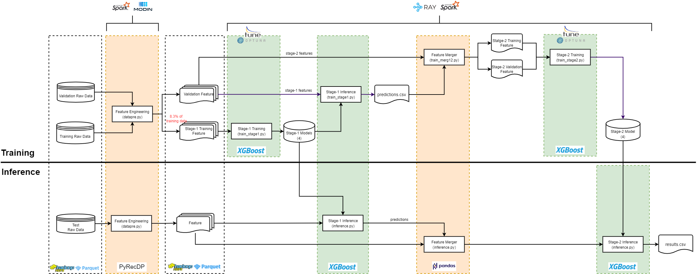
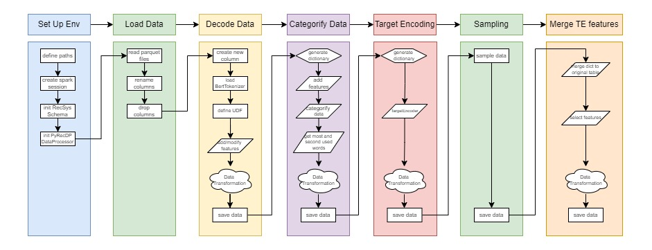
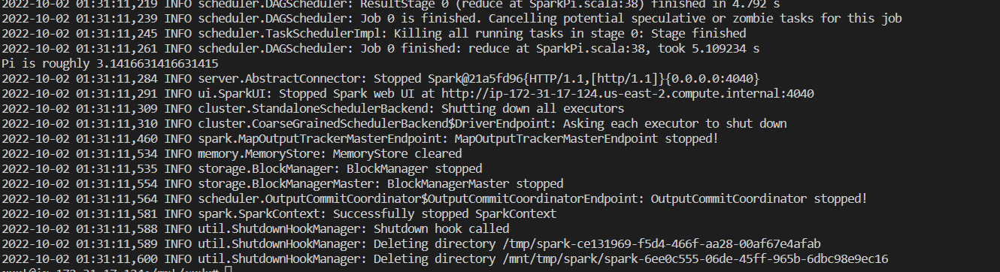

# Recommender System with Classical ML
This repository contains an end-to-end workflow for large-scale predictive analysis in tweet engagement prediction. It is originated from intel's democratization solution for the [ACM RecSys-2021 challenge](http://www.recsyschallenge.com/2021/) and is designed to be generalizable for a wide range of binary classification tasks on large-scale tabular dataset. The top 3 features of this workflow includes

- distributed data preprocessing, XGBoost training and hyperparameter optimization
- rich data processing & feature engineering techniques for large and heterogeneous input data (from 20 original features to 262 training features)
- simple but effective training strategies on CPU, e.g. training set subsampling, model stacking

## Table of Contents
- [Implementation Details](#implementation-details)
    - [Architecture](#architecture)
    - [Data Preprocessing Overview](#data-preprocessing-overview)
    - [Dependencies](#dependencies)
    - [Model Configuration](#model-configuration)
    - [Dataset](#dataset)
- [Installation](#installation)
    - [Prerequisites](#prerequisites)
    - [Step-by-step Instructions](#step-by-step-instructions)
- [Usage](#usage)
    - [Data Preprocessing](#data-preprocessing)
    - [Training](#training)
- [Troubleshooting](#troubleshooting)
- [License](#license)


## Implementation Details

### Architecture
As with all machine learning tasks, there are 2 phases in the T4 workflow: Training and Inference. During the training phase machine learning models are created by learning the underlying patterns within given data. During inference the trained models are used to draw conclusions from new data. The diagram below shows the overall architecture of the workflow: 


There are several things to be noted:

- we use 2-stage **model stacking** for training. Stacking is an ensemble method, in which we train new models that uses the prediction of other models as an input. As shown in the diagram, stage-1 models are trained using the stage-1 training features and then used to make predictions on the validation features. As next, these predictions are merged into the validation features and used as additional features for stage-2 training. We also split the original validation features into 2 part: one for training and one for validation. The final training results are evaluated on the stage-2 validation features. 
- we use **training set subsample** for training, where only 8.3% of the original training set is used for training. Our experimental data shows that increasing the training data size doesn't bring additional benefits in accuracy but longer training time.
- we include **2 ecosystems in one workflow**. The workflow is designed to be easy-to-use for people with different background. If you are a data engineer who is familiar with frameworks born out of Hadoop ecosystem, you can choose to run the whole workflow on Hadoop and Spark Cluster. If you are a data scientist who is used to Python ecosystem, then you can choose to run it on Modin and Ray, where Modin is for distributed data preprocessing and Ray for distributed XGboost training. But if you want to use Spark for data preprocessing and Ray for training or Modin for data preprocessing and Spark for training, it is also possible with the workflow.  


### Data Preprocessing Overview 
The T4 workflow contains extensive data processing & feature engineering techniques. The image below gives an overview of the major data preprocessing steps for stage-1 training.    

Regarding stage-2, the only difference is that stage-2 data preprocessing includes one more feature engineering technique called Count Encoding and it also split data into train and validation sets.

### Dependencies
The software dependencies can be found in the respective Dockerfile. Since there are only a few python software dependencies, we don't include a `requirement.txt` in this repo as we normally would do. You can find the python software dependencies in the `RUN pip install` line in the Dockerfile.   

### Model Configuration
Although the workflow comes with HPO functionality to boost last-mile predictive performance, we use the following model configuration as our default setting due to its simplicity and effectiveness:
```python
xgb_params = { 
    'max_depth':8, 
    'learning_rate':0.1, 
    'subsample':0.8,
    'colsample_bytree':0.8, 
    'eval_metric':'logloss',
    'objective':'binary:logistic',
    'tree_method':'hist',
    "random_state":42
}
```

### Dataset 
To download the challenge dataset, please follow the instructions on the official website of [RecSys2021 Challenge](http://www.recsyschallenge.com/2021/). We are not allowed to transfer the challenge dataset or host it publicly on the web. 


| **Type**:                | **Format** | **Size** | **Shape**
| :---                     | :---       | :---     | :---
| Training Dataset         | 201 parquet files  | 231 GiB (1.2 GiB each) | (63565312, 25)
| Validation Dataset       | 1 csv file         | 6.8 GiB   | (17354112, 25)

To make it easier for users to test the workflow, we include a python script to make synthetic data, which is under the path `src/data_loader`. You can use the following command to generate synthetic data:
```bash
python src/data_loader/generate_data.py --save_path [SAVE_DATA_PATH]
``` 

## Installation 
#### Prerequisites
- one host machine that has comparable configurations as follows

| **Name**:                | **Description**
| :---                              | :---
| CPU                               | Intel(R) Xeon(R) Platinum 8380 CPU @ 2.30GHz (160 vCPUs)
| Free RAM                          | 460 GiB/503 GiB
| Disk Size                         | 1.5 TB
| Disk Type                         | Sata-INTEL_SSDSC2KB019T7_PHYS7412006U1P9DGN
    

> **Note:** <br>It is also possible to run through the code using a machine with a smaller RAM, but then you will need to manually set the `spark.driver.memory` to a value that your machine can handle in the `datapre.py` script. But if you have not enough free disk space, Spark/Hadoop will have trouble processing all the raw data. In this case, you can consider reducing the data amount for preprocessing (note: it would affect the prediction accuracy) or use the already processed data to run the training job. 


- Docker installed on each machine 
- Raw Data  

#### Step-by-step Instructions
1. Download source code and define env variables
```bash
git clone https://github.com/intel/recommender-system-with-classical-ml.git
cd recommender-system-with-classical-ml
# define env variables for later usage
export HADOOP_PATH=[YOUR_LOCAL_TMP_FOLDER] #  YOUR_LOCAL_TMP_FOLDER should have at least 1TB free disk space and should not contain the `/` ending.
export DATA_PATH=[YOUR_LOCAL_DATA_FOLDER] # this folder should contain the train, valid and test folders
```
2. Prepare local folders for Hadoop and Spark 
```bash
# this command will create a tmp folder inside YOUR_LOCAL_TMP_FOLDER
./scripts/hadoop-folder-prep.sh $HADOOP_PATH 
```
> **Note:** <br>YOUR_LOCAL_TMP_FOLDER should have at least 2TB disk space and does not have the `/` ending.

3. Build docker image
```bash
./scripts/build-image.sh
```
If you encounter a network error, check whether you firewall has been stopped. The docker image build might fail if the firewall is shut down. 

4. Create a docker network named hadoop if not exits
```bash
sudo docker network create --driver=bridge hadoop
```

5. Start containers 

Before start, check the mounted paths in the following script; you may need to change the path depending on how the data and code are stored on your local machine. 
```bash
./scripts/start-container.sh -m 0 -d $DATA_PATH -h $HADOOP_PATH 
```
You should be prompted with bash command line in the container. Check whether your `/mnt` contains the following mounted folders:`code`, `data` and `tmp`.

6. Setup the environment
```bash
cd /mnt/code 
./scripts/prep-env.sh -a hadoop-master -b hadoop-master -c 0 -d 0
```
If the setup is successful, you should see the Pi value in the output log as shown below:



## Usage
### Data Preprocessing
On the master node, run the following bash script to load data from mounted directory to the HDFS inside the container. 
```bash 
./scripts/recsys-data-prep.sh
```
Go to the data preprocessing folder, run `datapre.py`
```bash
cd /mnt/code/src/data_preprocess
# for training dataset, for single-node, master node is hadoop-master, for multi-node, you need to find out the host machine's name of the master
python datapre.py train [MASTER_NODE]
# for validation dataset
python datapre.py valid_stage1 [MASTER_NODE]
python datapre.py valid_stage2 [MASTER_NODE]
``` 
For single-node training and inference, you need to download the preprocessed data from HDFS to your local disk:
```bash
# make a directory to store processed data
mkdir /mnt/data/processed_data 
# download pre-prcocessed training dataset
hdfs dfs -copyToLocal /recsys2021/datapre_stage1/stage1_train /mnt/data/processed_data
hdfs dfs -copyToLocal /recsys2021/datapre_stage1/stage1_valid /mnt/data/processed_data
# download preprocessed validation dataset
hdfs dfs -copyToLocal /recsys2021/datapre_stage2/stage2_train /mnt/data/processed_data
hdfs dfs -copyToLocal /recsys2021/datapre_stage2/stage2_valid /mnt/data/processed_data
# download preprocessed test dataset
hdfs dfs -copyToLocal /recsys2021/datapre_stage2/stage12_test /mnt/data/processed_data
```

### Training
#### single-node xgboost training
The training contains 3 steps. Each step is defined separately in 3 python scripts:
```bash
python src/models/xgboost/train_stage1.py --config-dir /mnt/code/config.yaml
python src/models/xgboost/train_merge12.py --config-dir /mnt/code/config.yaml
python src/models/xgboost/train_stage2.py --config-dir /mnt/code/config.yaml
```
> **Note:** <br>  in the `config.yaml`, some important configurations,e.g. model save path or data path, are defined. You may need to edit the file if you want more customizations. 

#### Quick Setup 
It is recommended to follow the step-by-step guide above to have a better grasp of what is happening under the hood. But if you just want to quickly run though the code and you are in the single-node&single-container mode, it is also possible to use the following command:
```bash
./scripts/run-all-single.sh
``` 


## Troubleshooting
Please refer to [Hadoop Traps & Pitfalls](docs/hadoop-traps-pitfalls.md) and [Spark Traps & Pitfalls](docs/spark-traps-pitfalls.md) for more information.


## License
[Apache License 2.0](LICENSE)